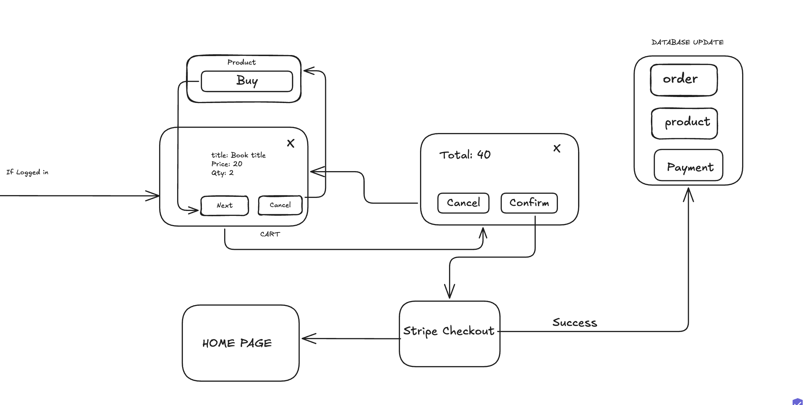

<h1 align="center">
    
</h1>


<h3 align="center">A modern e-commerce platform for buying and selling books!</h3>

<p align="center">

  
  
  <a href="https://github.com/ashiqur-russel/On.Book-Client">
    
  </a>
    
  

  
</p>

<h4 align="center"> 
	 Status: Ongoing
</h4>

<p align="center">
    


</p>

## About

**Book Shop Application** is a modern e-commerce platform designed for buying and selling books. It features secure user authentication, role-based access control, product management, and a seamless payment system. The platform is responsive, visually appealing, and provides a smooth user experience.

---

## Features

- [x] **User Authentication:**
  - Secure registration and login with JWT token-based authentication.
  - Role-based access control (user and admin roles).
- [x] **Product Management:**
  - Admins can add, update, and delete books.
  - Users can browse, search, and filter books.
- [x] **Order Management:**
  - Users can place orders, track order status, and cancel orders.
  - Admins can manage all orders (view, update, and cancel).
- [x] **Payment Integration:**
  - Integrated with **SurjoPay** for secure payments.
- [x] **Responsive Design:**
  - Fully responsive and works seamlessly on all devices.
- [x] **Product Reviews:**
  - Users can add reviews for books with ratings and comments.

---
	

## 🔄 Process Flow of Book Purchase

<h1 align="center">
    
</h1>


### 1️⃣ **User Selects a Product**
- A logged-in user navigates to the **Product Page**.
- Clicks the **"Buy"** button for a book.

### 2️⃣ **Cart Review**
- A modal/dialog displays the selected book details:
  - **Title**: Book title
  - **Price**: 20
  - **Quantity**: 2
  - **Total**: 40
- User can either:
  - **Proceed** (`Next` button) to confirm purchase.
  - **Cancel** (`Cancel` button) to abort.

### 3️⃣ **Order Confirmation**
- A final **confirmation modal** shows the total price.
- User can either:
  - **Confirm** (`Confirm` button) to proceed to checkout.
  - **Cancel** (`Cancel` button) to stop the process.

### 4️⃣ **Stripe Checkout**
- After confirmation, the user is redirected to **Stripe's secure payment gateway**.
- User enters payment details (card, PayPal, etc.) and completes the payment.

### 5️⃣ **Payment Success & Database Update**
- On successful payment:
  - **Order details are stored** in the database.
  - **Product stock is updated**.
  - **Payment details are recorded**.
- The user is redirected back to the **Home Page**.


## How to run Locally

The project is divided into two parts:

1. **Backend** (another repo) - Handles API requests, database operations, and authentication.
2. **Frontend** (this repo) - Provides the user interface and interacts with the backend.

### Pre-requisites

Before you begin, ensure you have the following tools installed:
- [Git](https://git-scm.com/)
- [Node.js](https://nodejs.org/en/)
- A code editor like [VSCode](https://code.visualstudio.com/)

#### Running the web application (Frontend)

```bash
# Clone this repository
$ git clone https://github.com/ashiqur-russel/On.Book-Client.git

# Access the project folder in your terminal
$ cd bOn.Book-Client

# Install the dependencies
$ npm install

# Run the application in development mode
$ npm start dev

# The application will open on port 3000 - go to http://localhost:5723
